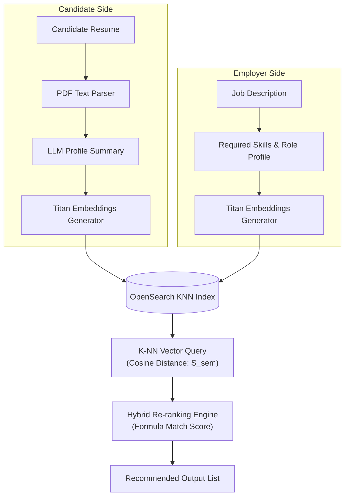

# AI Recommendation Architecture Document
## Semantic Vector Matching & RAG Pipeline

---

## 1. Match Recommendation Pipeline

Apply4Jobs implements semantic matching by mapping both candidate profiles and job descriptions into the same embedding space using the Amazon Bedrock embedding model (e.g., `amazon.titan-embed-text-v2:0`).

---

## 2. Re-Ranking Formula

Instead of relying solely on raw vector similarity, the platform uses a hybrid matching formula to calculate the final match score ($S_{total}$):

$$S_{total} = w_{sem} \cdot S_{sem} + w_{skills} \cdot S_{skills} + w_{exp} \cdot S_{exp} + w_{loc} \cdot S_{loc}$$

Where:
- $S_{sem}$: Cosine similarity of candidate summary embeddings vs job listing embeddings (Weight $w_{sem} = 0.40$).
- $S_{skills}$: The Jaccard similarity index of candidate skills ($C_{skills}$) vs job required skills ($J_{skills}$):
  $$S_{skills} = \frac{|C_{skills} \cap J_{skills}|}{|C_{skills} \cup J_{skills}|}$$ (Weight $w_{skills} = 0.30$).
- $S_{exp}$: Experience match score (Weight $w_{exp} = 0.20$), matching years of experience within required ranges.
- $S_{loc}$: Location / Remote match status (Weight $w_{loc} = 0.10$).

---

## 3. RAG Architecture for Career Coach

The **AI Career Coach** uses a Retrieval-Augmented Generation (RAG) architecture:
1. **Query**: The candidate asks a question: *"How do I transition from Web Developer to AI Engineer?"*
2. **Retrieve**:
   - Query is embedded.
   - We retrieve the candidate's parsed skills matrix, experience history, and target role from Postgres.
   - We retrieve active, highly relevant AI job specifications from OpenSearch.
3. **Augment**:
   - The system formats a prompt containing the candidate's profile, target role, and the current market requirements (skills gap).
4. **Generate**:
   - Sent to AWS Bedrock (Claude 3.5 Sonnet / Llama 3).
   - Generates a personalized career transition plan.
