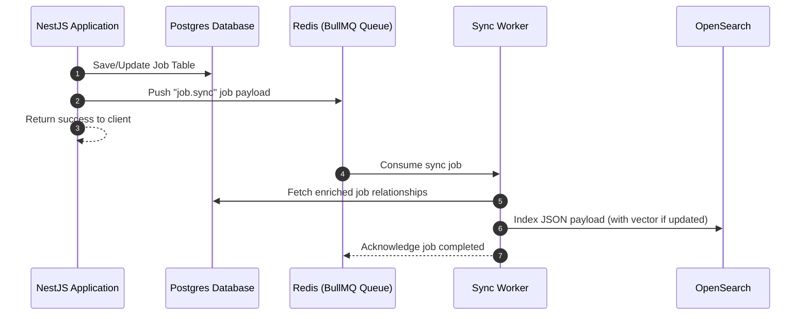

# Caching & Search Architecture Document
## Redis Caching and OpenSearch Integration Strategy

---

## 1. Redis Caching Configuration

To maintain response latencies below 100ms under heavy request loads, Apply4Jobs employs an in-memory Redis cluster.

### 1.1 Cache Keys and Expiry Matrix
| Cache Key Pattern | Purpose | Expiry Strategy | Eviction Behavior |
| :--- | :--- | :--- | :--- |
| `session:{userId}` | Active candidate/employer JWT verification payloads | 86400s (24h) | Least Recently Used (LRU) |
| `rate:{ipAddress}` | API endpoint throttling and sliding window tokens | 60s (1m) | Strict TTL eviction |
| `jobs:featured` | Seed listings on candidate landing dashboard pages | 900s (15m) | LRU eviction |
| `job:{jobId}` | Detailed job listing content | 3600s (1h) | Write-invalidate (evict on update) |
| `recs:{candidateId}` | AI similarity scoring output indices | 1800s (30m) | Evict on resume upload |

---

## 2. OpenSearch Schema Index Mappings

OpenSearch handles fast keyword searches and vector computations. Below is the mapping definition for the `jobs` index.

```json
{
  "settings": {
    "index": {
      "number_of_shards": 3,
      "number_of_replicas": 1,
      "knn": true
    }
  },
  "mappings": {
    "properties": {
      "id": { "type": "keyword" },
      "tenantId": { "type": "keyword" },
      "title": {
        "type": "text",
        "analyzer": "english",
        "fields": {
          "suggest": { "type": "completion" }
        }
      },
      "description": { "type": "text", "analyzer": "english" },
      "skills": { "type": "keyword" },
      "experienceMin": { "type": "integer" },
      "salaryMin": { "type": "integer" },
      "location": {
        "type": "object",
        "properties": {
          "geo_coords": { "type": "geo_point" },
          "city": { "type": "keyword" },
          "country": { "type": "keyword" }
        }
      },
      "jobVector": {
        "type": "knn_vector",
        "dimension": 1536,
        "method": {
          "name": "hnsw",
          "space_type": "cosinesimil",
          "engine": "nmslib",
          "parameters": {
            "ef_construction": 128,
            "m": 16
          }
        }
      }
    }
  }
}
```

---

## 3. Data Sync Flow (Postgres to OpenSearch)

To prevent transactional bottlenecks, Postgres writes are synced to OpenSearch asynchronously:


This asynchronous indexing ensures that write requests return instantly, while OpenSearch is updated within ~1-2 seconds.
