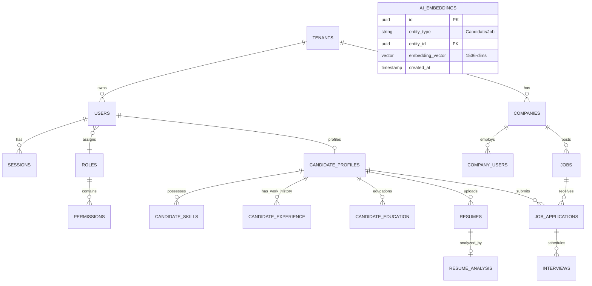

# Database Design Document
## Apply4Jobs Relational Schema & Indexes

---

## 1. Relational ER Diagram

This schema models tenants, users, roles, jobs, resume analyses, applications, interviews, and embedding tables.

---

## 2. Table Column Configurations

### 2.1 Users (`users`)
- `id` (UUID, Primary Key, Default: `uuid_generate_v4()`)
- `tenant_id` (UUID, Foreign Key referencing `tenants.id`, Nullable for Candidates/SuperAdmins)
- `email` (VARCHAR, Unique, Indexed)
- `password_hash` (VARCHAR)
- `phone_number` (VARCHAR, Nullable)
- `is_verified` (BOOLEAN, Default: false)
- `mfa_secret` (VARCHAR, Nullable)
- `created_at` (TIMESTAMP, Default: `now()`)

### 2.2 Candidate Profiles (`candidate_profiles`)
- `id` (UUID, Primary Key)
- `user_id` (UUID, Foreign Key referencing `users.id`, Unique)
- `full_name` (VARCHAR)
- `avatar_url` (VARCHAR, Nullable)
- `portfolio_url` (VARCHAR, Nullable)
- `profile_completion_score` (INT, Default: 0)
- `skills_summary` (TEXT, Nullable)
- `updated_at` (TIMESTAMP)

### 2.3 Resumes (`resumes`)
- `id` (UUID, Primary Key)
- `candidate_id` (UUID, Foreign Key referencing `candidate_profiles.id`)
- `file_url` (VARCHAR)
- `parsed_text` (TEXT)
- `is_active` (BOOLEAN, Default: true)

### 2.4 Resume Analysis (`resume_analysis`)
- `id` (UUID, Primary Key)
- `resume_id` (UUID, Foreign Key referencing `resumes.id`, Unique)
- `ats_score` (INT)
- `quality_score` (INT)
- `extracted_skills` (JSONB)
- `improvement_suggestions` (JSONB)
- `career_recommendations` (JSONB)

### 2.5 Jobs (`jobs`)
- `id` (UUID, Primary Key)
- `company_id` (UUID, Foreign Key referencing `companies.id`, Indexed)
- `title` (VARCHAR, Indexed)
- `description` (TEXT)
- `status` (VARCHAR)  -- 'Draft', 'Review', 'Published', 'Closed', 'Archived'
- `salary_min` (INT)
- `salary_max` (INT)
- `experience_min` (INT)
- `experience_max` (INT)
- `skills_required` (JSONB)
- `expiry_date` (TIMESTAMP)

---

## 3. Database Indexing Strategy

To support enterprise operations with sub-100ms speeds, the following database indexes are applied:

1. **B-Tree Indexes**:
   - `CREATE INDEX idx_users_email ON users(email);`
   - `CREATE INDEX idx_jobs_company_id ON jobs(company_id);`
   - `CREATE INDEX idx_jobs_status ON jobs(status) WHERE status = 'Published';`
   - `CREATE INDEX idx_job_applications_candidate_id ON job_applications(candidate_id);`
   
2. **JSONB Gin Indexes**:
   - `CREATE INDEX idx_jobs_skills_gin ON jobs USING gin (skills_required);`
   - `CREATE INDEX idx_resume_analysis_skills_gin ON resume_analysis USING gin (extracted_skills);`

3. **Vector/K-NN Index (OpenSearch Side)**:
   - Cosine similarity algorithm on candidate resume vectors vs job posting vectors.
