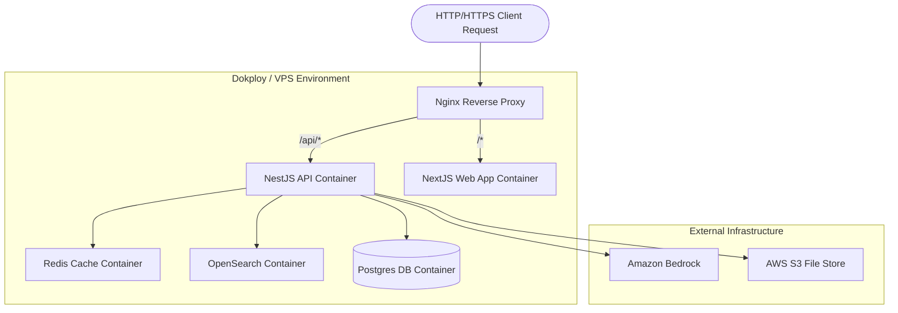

# DevOps & Deployment Guide
## Multi-Tenant VPS Deployment, Hosting, and Resilience

---

## 1. Hosting Architecture on VPS

Apply4Jobs is deployed on a VPS (Virtual Private Server) managed via **Dokploy** or **Dokku**. Nginx directs traffic to respective Next.js and NestJS Docker containers.



---

## 2. Server Resource Allocations

For a VPS cluster handling initial workloads (scaling up to 100k active users):

- **CPU**: 4 vCPUs (Intel Xeon / AMD EPYC based instances)
- **RAM**: 16 GB DDR4 (Allocated: Postgres 4GB, OpenSearch 4GB, Redis 1.5GB, NestJS 2GB, Next.js 2GB, OS & System 2.5GB)
- **Disk**: 160 GB NVMe Storage (SSD)
- **Bandwidth**: 10 TB/month (1 Gbps port)

---

## 3. Database Backup and Recovery Routines

To guarantee zero-data-loss for core databases, daily automation cron tasks run:

### 3.1 Automated Script (`/opt/scripts/backup-postgres.sh`)
```bash
#!/bin/bash
BACKUP_DIR="/var/backups/postgres"
TIMESTAMP=$(date +"%Y%m%d_%H%M%S")
FILENAME="${BACKUP_DIR}/apply4jobs_prod_${TIMESTAMP}.sql.gz"

# Create directories if missing
mkdir -p ${BACKUP_DIR}

# Execute database dump
docker exec -t apply4jobs-postgres pg_dumpall -U postgres | gzip > ${FILENAME}

# Sync to secure AWS S3 cold bucket
aws s3 cp ${FILENAME} s3://apply4jobs-backups/postgres/

# Clean up local backups older than 7 days
find ${BACKUP_DIR} -type f -mtime +7 -name "*.sql.gz" -delete
```

### 3.2 OpenSearch Snapshots
OpenSearch snapshot management policies (SMP) are scheduled to execute daily at `02:00 UTC`, creating increments saved directly to S3 storage buckets.
