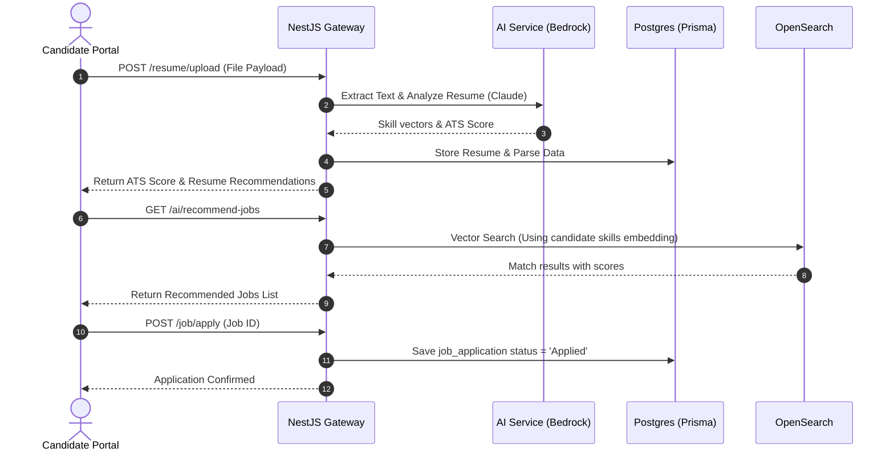
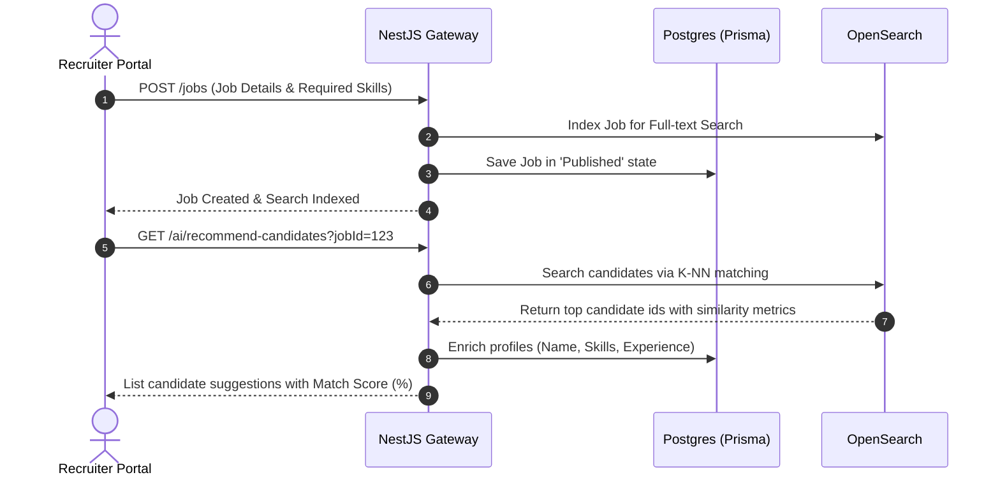

# High-Level Design (HLD) Document
## Apply4Jobs Marketplace Platform

---

## 1. System Components Layout

The system is designed with five key conceptual layers:
1. **User Presentation Layer**: Next.js React client with Responsive/Mobile-first CSS layouts.
2. **Security & Routing Layer**: API gateway handles rate limiting, tenant-header detection, CORS verification, and JWT parsing.
3. **Application Logic Layer (Microservice Monolith)**: The core NestJS application handles state business logic.
4. **Cognitive AI Layer**: Handles resume parsing, text embedding generation, vector matches, and career coach LLM calls.
5. **Persistent Storage Layer**: Database (Postgres), In-Memory Cache (Redis), and Full-Text Search Engine (OpenSearch).

---

## 2. Core Functional Flows

### 2.1 Candidate Journey: Resume Analysis and Apply

### 2.2 Employer Journey: Job Posting and Matching

---

## 3. Data Integration Interfaces

### 3.1 OpenSearch Search Integration
Jobs are indexed using the following elastic search JSON structure:
- `id`: Job identifier
- `tenantId`: Tenant owner identifier
- `title`: Title string (supports autocomplete indexing)
- `description`: Plain text description
- `skills`: Array of keyword tags
- `salaryMin` / `salaryMax`: Numeric boundaries
- `experienceMin` / `experienceMax`: Numeric boundaries
- `embedding`: Vector block [Float x 1536] (from Amazon Bedrock embedding model)

### 3.2 Redis Cache Sync Pattern (Cache-Aside Pattern)
- When a job is retrieved by ID, check Redis: `job:id`.
- If cache hit: Return payload.
- If cache miss: Query database via Prisma, write to Redis with a 3600-second TTL, and return.
- On job modification/deletion: Expire/evict keys `job:id` and purge associated search result caches.
