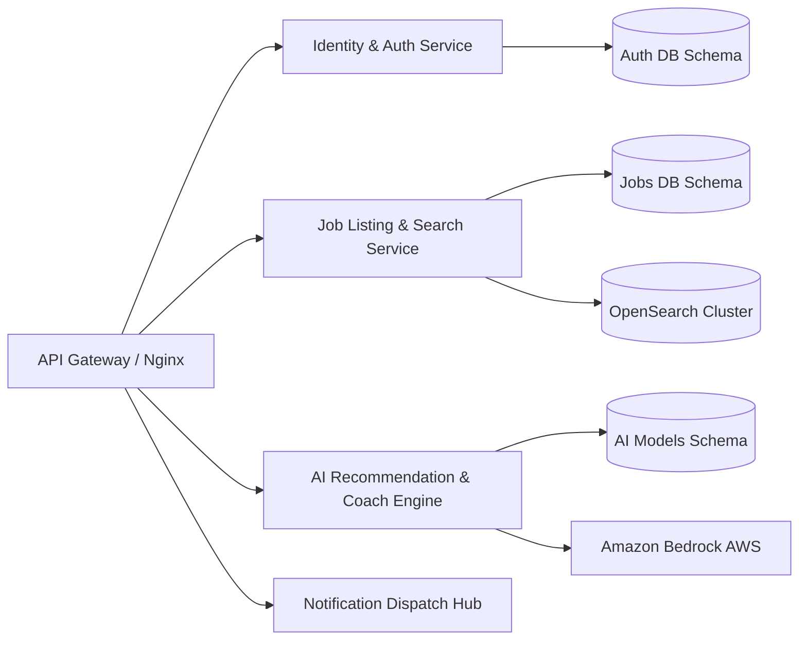

# Microservices & Security Architecture Document
## Service Partitioning, RBAC Matrix, and Security Standards

---

## 1. Domain-Driven Microservice Layout

To facilitate independent scaling and deployments, Apply4Jobs is partitioned into domains. Within our monorepo, these modules are designed to run as standalone services if required:

---

## 2. RBAC Permission Matrix

The application enforces strict Role-Based Access Control (RBAC) across standard endpoints:

| Module / Endpoint | Super Admin | Tenant Admin | Employer/Recruiter | Candidate | Moderator |
| :--- | :---: | :---: | :---: | :---: | :---: |
| `POST /auth/register` | ✅ | ✅ | ✅ | ✅ | ❌ |
| `POST /jobs` (Create) | ✅ | ✅ | ✅ | ❌ | ❌ |
| `PUT /jobs/:id` (Edit) | ✅ | ✅ | ✅ | ❌ | ❌ |
| `POST /resume/upload` | ❌ | ❌ | ❌ | ✅ | ❌ |
| `POST /job/apply` | ❌ | ❌ | ❌ | ✅ | ❌ |
| `POST /ai/skill-gap` | ❌ | ❌ | ✅ | ✅ | ❌ |
| `DELETE /tenant/:id` | ✅ | ❌ | ❌ | ❌ | ❌ |
| `POST /jobs/:id/approve`| ✅ | ❌ | ❌ | ❌ | ✅ |

---

## 3. Security & Compliance Configurations

### 3.1 GDPR & DPDPA Compliance
- **Right to Erasure (Right to be Forgotten)**: Candidate account deletion triggers cascading removal of personal info, profiles, resume files from S3, and vector profiles from OpenSearch.
- **Data Minimization**: Resume files are encrypted at rest using AES-256 before upload.

### 3.2 OWASP Top 10 Mitigation
1. **Injection (SQL & Command)**: Use Prisma ORM parameterized queries exclusively. Avoid raw string interpolation.
2. **Broken Object Level Authorization (BOLA)**: NestJS Route Guards check database ownership metadata (e.g., verifying `job.company_id == recruiter.company_id`) on all mutative operations.
3. **Security Misconfiguration**: Production environments disable debug/warning stacks in response payloads and set CORS headers to specific host configurations.
