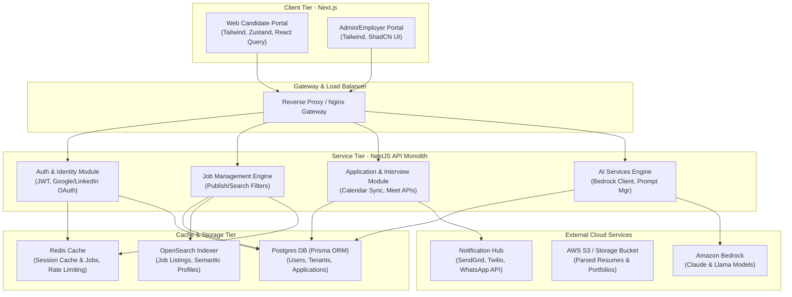

# System Architecture Document

This document outlines the architectural boundaries, subsystems, and interaction mechanics of the Apply4Jobs Multi-Tenant SaaS platform.

---

## 1. High-Level Architecture Diagram

The system employs a Monorepo containing Next.js micro-frontends and a NestJS API backend layer. Data storage is partitioned per tenant using postgres schemas/tenant IDs, with OpenSearch handling vector embeddings and Redis scaling performance.

---

## 2. Core Subsystems

### 2.1 Next.js Frontends (Monorepo `/apps/web` and `/apps/admin`)
- **Web App**: Built with Next.js 15 App Router. candidate landing page, profiles, matching list, ATS feedback visualizer, and career guidance dashboard.
- **Admin App**: Management workspace for tenants, recruiter accounts, analytics graphs, and support.
- Uses **Zustand** for lightweight client-side state, **Tailwind CSS** for custom aesthetics, and **React Query** for server-side cache/data sync.

### 2.2 NestJS Backend API Core (`/apps/api`)
- Single modular NestJS app designed for monorepo scaling.
- Separated modules: `AuthModule`, `JobsModule`, `CandidatesModule`, `AIModule`, `TenantModule`, `NotificationsModule`.
- Configured with Global Interceptors for rate limiting (using Redis) and Exception Filters for standardized error responses.

### 2.3 Data Infrastructure
- **Postgres Database**: Storage of users, billing records, applications, logs, and metadata. Handled via **Prisma Client**.
- **Redis**: In-memory store handling:
  - Cache: Hot job listings and candidate profiles.
  - Rate limiting: Guarding endpoints.
  - Search results matching popular keywords.
- **OpenSearch**: Standard search query indexes alongside a vector storage index (K-NN) enabling semantic candidate/job matching via cosine distance calculations.

### 2.4 AI Pipeline Interface
- Built using the **Amazon Bedrock SDK** to execute queries on Claude (for complex resume reviews and skill roadmaps) and Llama models (for fast intent checks and summary extractions).
- Custom prompt templates reside in the code database (`packages/shared/prompts`).
