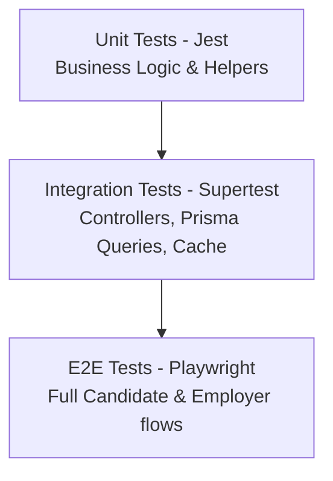

# Testing Strategy & Production Readiness Checklist

This document details the quality assurance testing framework, targets, and launch validation steps for Apply4Jobs.

---

## 1. Testing Strategy Framework

The system ensures quality across the monorepo using three distinct test suites:

### 1.1 Test Execution Commands
- **Unit & Integration Tests (NestJS)**:
  `npm run test:cov` (run inside `/apps/api`)
- **End-to-End Tests (Next.js)**:
  `npm run test:e2e` (run inside `/apps/web` using Playwright)

---

## 2. Target Performance Benchmarks

| Metric Category | Target threshold | Assessment Tool |
| :--- | :--- | :--- |
| **P95 Latency (Search)** | `< 100ms` | K6 Load Testing Script |
| **Max Concurrent Users** | `10,000` active connections | AWS Distributed Load Testing |
| **Lighthouse Performance**| `> 90` (Candidate Landing) | Google Lighthouse |
| **Test Coverage** | `> 80%` code coverage lines | Jest/Istanbul |

---

## 3. Production Readiness Checklist

Before going live, the deployment team must confirm the following checklist items:

### 3.1 Environment Configuration & Secrets
- [ ] Rotate all database passwords and generate secure JWT secrets (`JWT_SECRET` minimum 256 bits).
- [ ] Turn off debug logging flags (`NODE_ENV=production`, NestJS logger level set to `log,error`).
- [ ] Enforce SSL/TLS certificates (Let's Encrypt auto-renewal) on all endpoints.

### 3.2 Reliability and Scale
- [ ] Configure PostgreSQL autovacuum settings and enable connection pooling (using Prisma PgBouncer or similar).
- [ ] Configure Redis memory policies to `volatile-lru` to prevent memory exhaustion under load.
- [ ] Initialize system monitoring agents (Prometheus node-exporter and Vector for log shipping).

### 3.3 Security Audits
- [ ] Run `npm audit` on all package scopes and resolve critical vulnerabilities.
- [ ] Verify CORS headers allow only the staging/production domain roots.
- [ ] Enable rate-limiting filters globally on the NestJS ingress controller.
