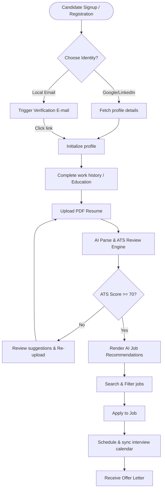
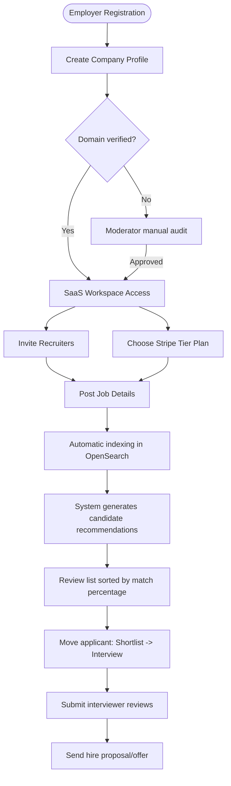

# User Flow Diagrams

This document contains step-by-step user interaction pipelines for both Candidates and Recruiters.

---

## 1. Candidate Interactive Journey

The diagram below maps the candidate's lifecycle from signing up to receiving a job offer.

---

## 2. Employer & Recruiter Journey

The diagram below maps the employer's interaction flow from registering their company to hiring.

